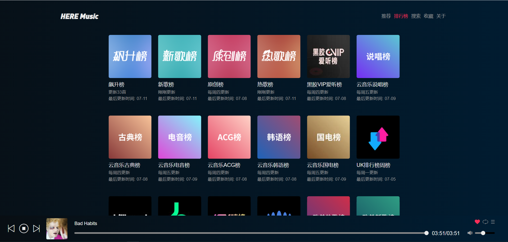
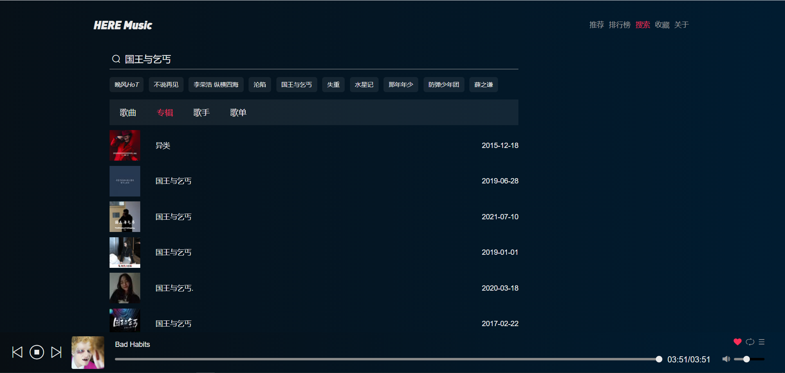
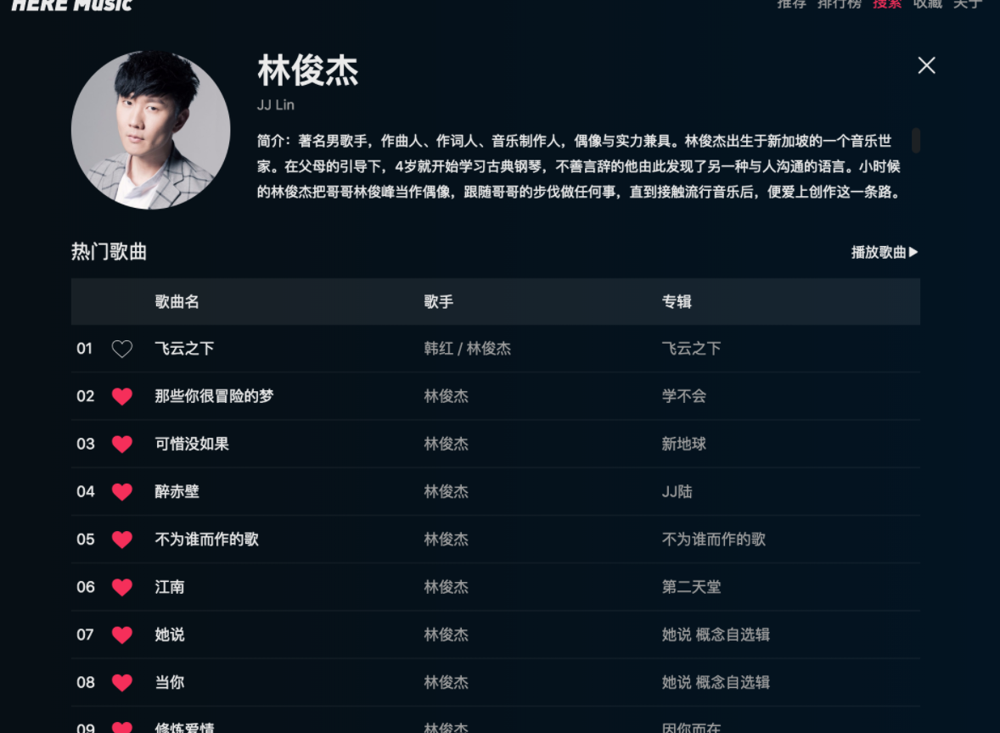
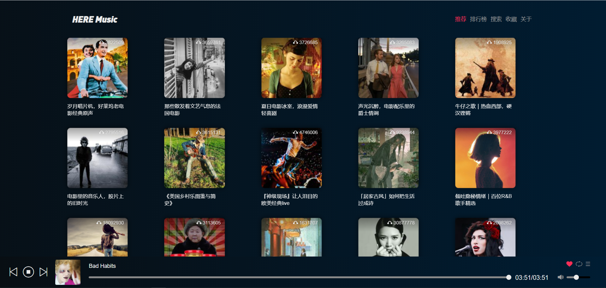
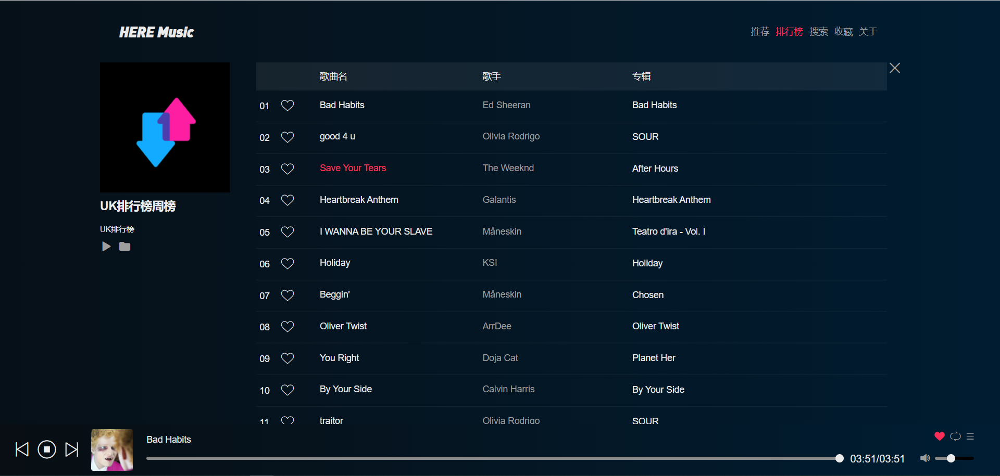
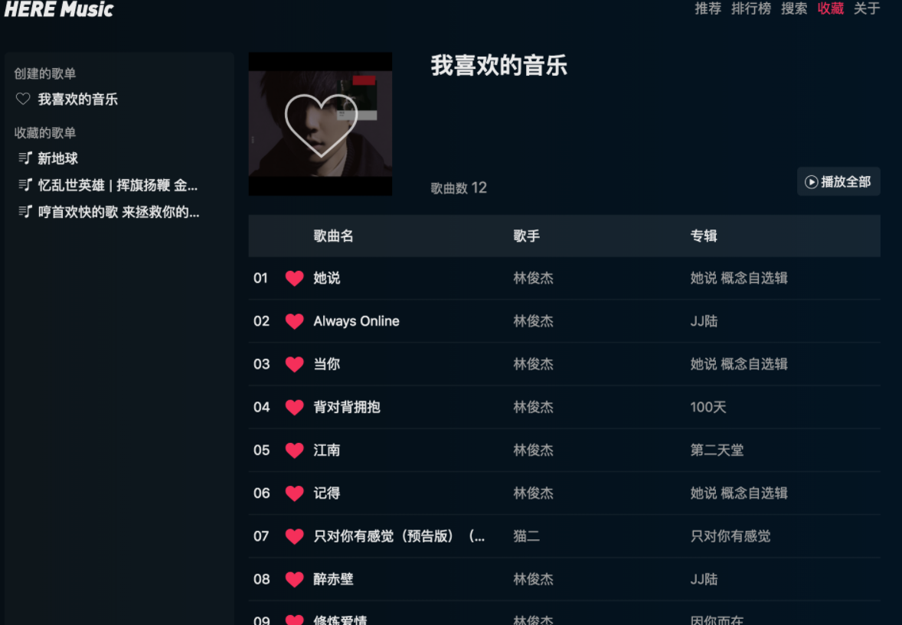

# 基于网易云api的音乐网站

## 页面展览

 

This project was bootstrapped with [Create React App](https://github.com/facebook/create-react-app).

## Available Scripts

In the project directory, you can run:

### `yarn start`

Runs the app in the development mode.\
Open [http://localhost:3000](http://localhost:3000) to view it in the browser.

The page will reload if you make edits.\
You will also see any lint errors in the console.

### `yarn test`

Launches the test runner in the interactive watch mode.\
See the section about [running tests](https://facebook.github.io/create-react-app/docs/running-tests) for more information.

### `yarn build`

Builds the app for production to the `build` folder.\
It correctly bundles React in production mode and optimizes the build for the best performance.

The build is minified and the filenames include the hashes.\
Your app is ready to be deployed!

See the section about [deployment](https://facebook.github.io/create-react-app/docs/deployment) for more information.

## 支持功能
 
- [x] 推荐歌单
- [x] 排行榜
- [x] 歌单展示
- [x] 歌曲详情
- [x] 歌词展示
- [x] 歌手详情
- [x] 播放列表
- [x] 喜欢歌曲
- [x] 收藏歌单
- [x] 播放模式切换
- [x] 收藏歌单
- [x] 搜索功能
- [x] 进度条展示
- [x] 进度跳转
- [x] 音量控制
